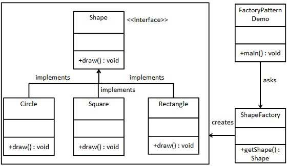
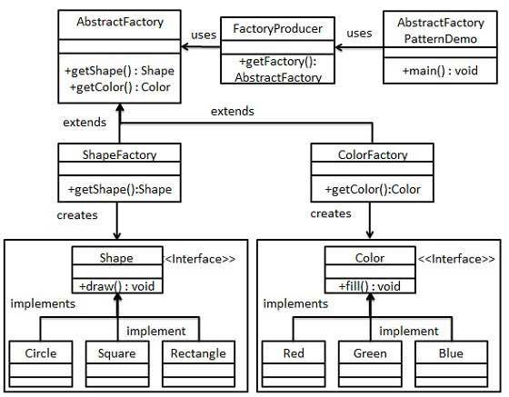
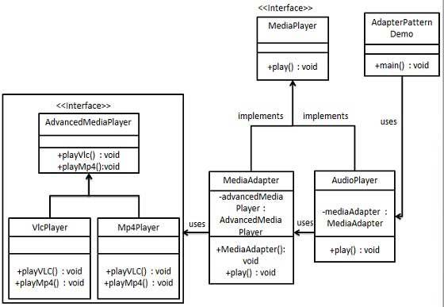
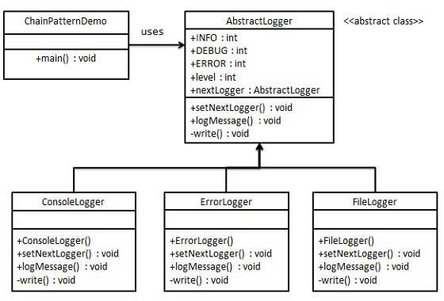
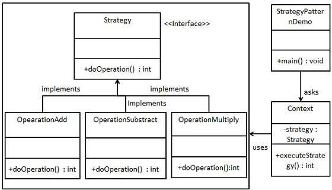
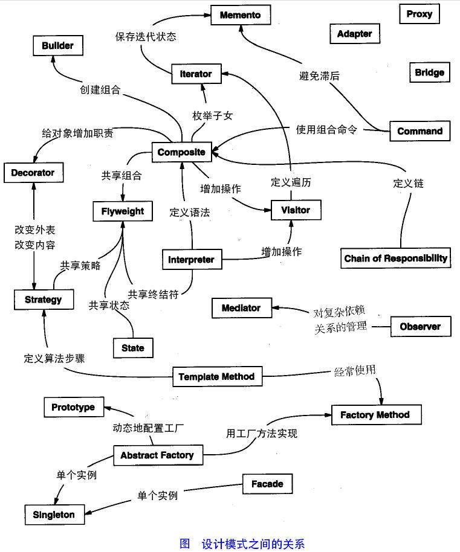

# JavaDesignPattern
java设计模式案例

# 设计模式的类型

## 1、创建型模型
这些设计模式提供了一种在创建对象的同时隐藏创建逻辑的方式，而不是使用新的运算符直接实例化对象。这使得程序在判断针对某个给定实例需要创建哪些对象时更加灵活。

+ 工厂模式（factoryPattern pattern）
+ 
+ 抽象工厂模式（abstract factoryPattern pattern）
+ 
+ 单例模式（singleton pattern）
+ 建造者模式（builder pattern）
+ 原型模式（prototype pattern）

## 2、结构型模型
这些设计模式关注类和对象的组合。继承的概念被用来组合接口和定义组合对象获得新功能的方式。

+ 适配器模式（adapter pattern）
+ 
+ 桥接模式（bridge pattern）
+ 过滤器模式（filter、criteria pattern）
+ 组合模式（composite pattern）
+ 装饰器模式（decorator pattern）
+ 外观模式（facade pattern）
+ 享元模式（flyweight pattern）
+ 代理模式（proxy pattern）

## 3、行为型模型
这些设计模式特别关注对象之间的通信

+ 责任链模式（chain of responsibility pattern）
+ 
+ 命令模式（command pattern）
+ 解释器模式（interpreter pattern）
+ 迭代器模式（iterator pattern）
+ 中介者模式（mediator pattern）
+ 备忘录模式（memento pattern）
+ 观察者模式（observer pattern）
+ 状态模式（state pattern）
+ 空对象模式（null object pattern）
+ 策略模式（strategyPattern pattern）
+ 
+ 模版模式（template pattern）
+ 访问者模式（visitor pattern）

## 4、J2EE模式
这些设计模式特别关注表示层。这些模式是由Sun Java Center 鉴定的。

+ mvc模式（mvc pattern）
+ 业务代表模式（business delegate pattern）
+ 组合实体模式（composite entity pattern）
+ 数据访问对象模式（data access object pattern）
+ 前端控制器模式（front controller pattern）
+ 拦截过滤器模式（intercepting filter pattern）
+ 服务定位器模式（service location pattern）
+ 传输对象模式（transfer object pattern）

设计模式之间的关系

# 设计模式的六大原则

## 1、开闭原则（open close principle）
开闭原则的意思是：**对扩展开放，对修改关闭**。在程序需要进行扩展的时候，不能去修改原有代码，实现一个热插拔的效果。
简言之，是为了使程序的扩展性好，易于维护和升级。想要达到这样的效果，我们需要使用接口和抽象类。

## 2、里氏替换原则（liskov substitution principle）
里氏替换原则是面向对象设计的基本原则之一。里氏替换原则中说，任何基类可以出现的地方，子类一定可以出现。lsp 是继承复用
的基石，只有当派生类可以替换掉基类，且软件单位的功能不受到影响时，基类才能真正被复用，而派生类也能够在基类的基础上增加
新的行为。里氏替换原则是对开闭原则的补充。实现开闭原则的关键步骤就是抽象化，而基类与子类的继承关系就是抽象化的具体实现
，所以里氏替换原则是对抽象类的具体步骤的规范。

## 3、依赖倒转原则（dependence inversion principle）
这个原则是开闭原则的基础，具体内容：针对接口编程，依赖于抽象而不依赖于具体。

## 4、接口隔离原则（interface segregation principle）
这个原则的意思是：使用多个隔离的接口，比使用单个接口要好。它还有另外一个意思是：降低类之间的耦合度。由此可见，其实设计
模式就是从大型软件架构出发、便于升级和维护的软件设计思想，它强调降低依赖，降低耦合。

## 5、迪米特法则又称最少知道原则（demeter principle）
最少知道的原则是指：一个实体应当尽量少的与其它实体之间发生相互作用，使得系统功能模块相对独立。

## 6、合成复用原则（composite principle）
合成复用原则是指：尽量使用合成/聚合的方式，而不是使用继承。

